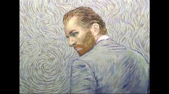
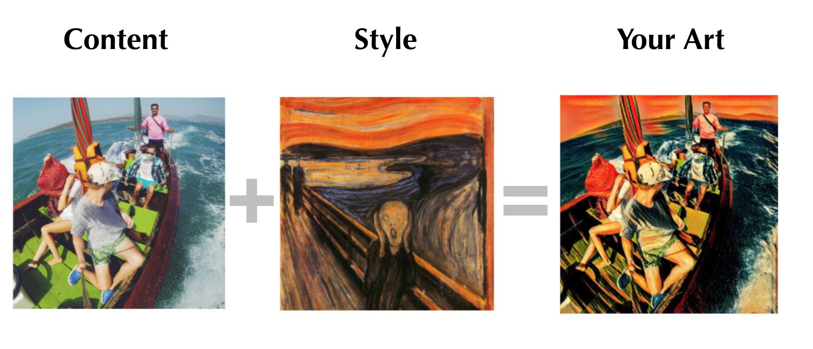
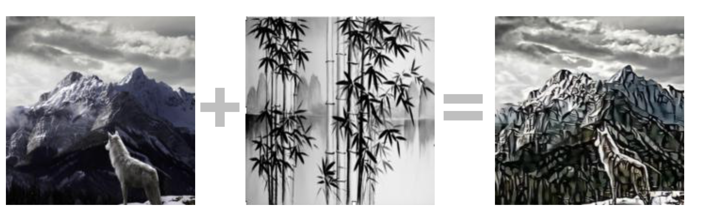
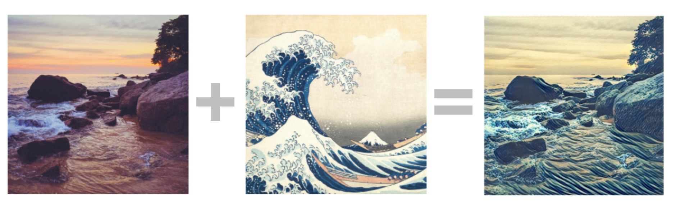
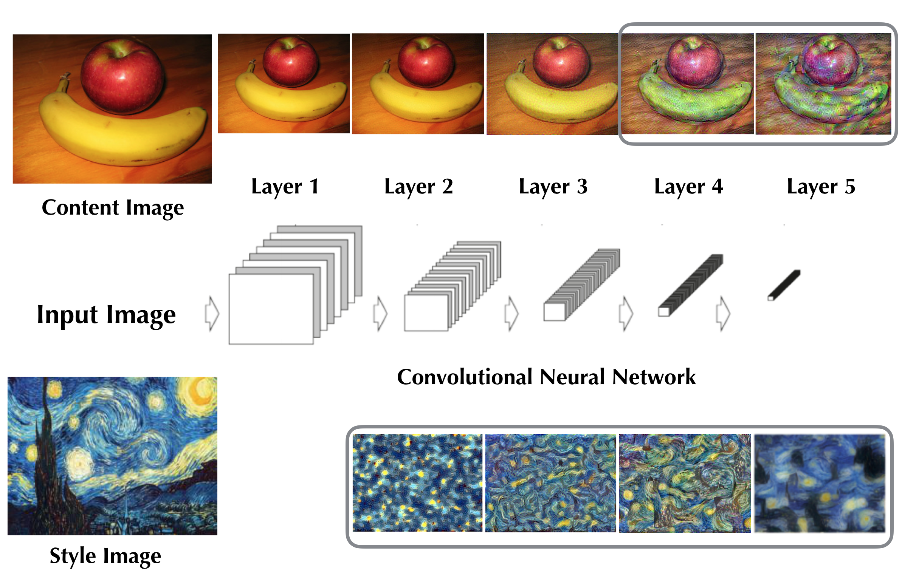
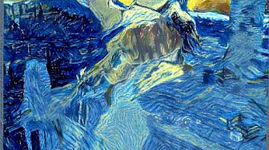
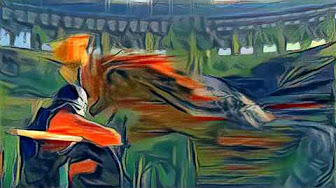

## Intro  
This is the passion project that I did for the Metis bootcamp. It leverages convolutional neural network to perform artistic style transfer on videos.  

## Motivation  
  
Loving Vincent is the world's first fully painted animation movie that took a team of 115 artists who painstakingly painted every single one of the 67,000 frames. The size of all these oil paintings combined would cover the entire island of Manhattan. This might be the best way to pay tribute to Van Gogh, however, it is not scalable. Given the recent developments in the computer vision, can we create a more strategic solution? 

## Style Transfer with Static Images
The idea of tyle transfer is to create a stylized image that combines the style of an artwork with the content of an image. Here are a few examples.  

 
  
  
These stylized images capture the color scheme and texture of the painting while preserve the content the picture. There are mobile apps such as [prisma](http://prisma-ai.com/) and [pikazo](http://www.pikazoapp.com/) that popularized style transfer in the last year. It all started with the this paper [A Neural Algorithm of Artistic Style](https://arxiv.org/pdf/1508.06576v2.pdf), in which it proposes to extract content and style features from a convolutional neural network and create an stylize image by minimizing a loss function. 

### Feature Extraction  
Convolutional Neural Networks perform exceptionally well in image classfication tasks. They consist of layers of neuron that each extract certain features and the output of each layer can be considered as the filtered version of the input image.   
If we reconstruct the content of an input image at each layer by visulizing the output, we can see that the network is able to capture more abstract representation as we progress towards higher levels of layers. In this case, it appears that feature maps from layer 4 and 5 would be appropriate content representations.  
For style representations, the paper calculates the feature correlations(Gram Matrices) between filter responses. The visulization shows that the correlations match the style in increasing scale as we go through the network. And it uses all layers to represent style. 

  

### Loss Function
The loss function consists of two parts: content loss and style loss.  
The content loss is the sum of squared element-wise errors between the feature responses at layer 5 of the content image and that of the stylized image. Whereas the style loss is the sum of squared errors between the Gram matrices at all layers.  
The two terms need to have appropriate weights in order to perform properly. This step would require some level of trial and error.  
The stylized image is found by minimizing the loss function and the optimization is performed using L-BFGS. 

## Style Transfer with Videos  
Style transfer on static images has been widely researched. However, studies on video style transfer are fairly new.  Although a video is a collection of staic images, we cannot directly combine individual stylized frames because of randomness in the initialization would cause unpleasant background flickering. 

In order to mitigate this artifact, this paper [Artistic Style Transfer for Videos](https://arxiv.org/pdf/1604.08610v2.pdf) proposes a few fixes. Their implementation was coded in LUA with Torch as the backend. I modified the Keras neural transfer example to incorporate the image warping and temporal constraints.  
1. Image warping is to initialize the image from the previous stylized frame by taking into condsideration the optical flows between adjacent frames.   
2. Temporal constraint stablizes the regions that do not have moving objects.   
 
The workflow is as follows:  
1. Scraped 20k images of paintings and pictures from Flickr to finetune the last convolutional layer of VGG16 so that it is able to distinguish paintings from pictures at 88%.  
2. Generate optical flow and weights for temporal constraints using [deep matching](http://lear.inrialpes.fr/src/deepmatching/).   
3. Perform style transfer on frames with initialization and temporal loss.  

## Stylized Videos
Please enjoy the following videos that I created for this project.    

### Flying Bat in Starry Night Style  
   

### Game of Thrones: Gradual Style Transitions between Muse and Scream  
  

## Current Research and Progress
The frame by frame optimization is a very slow way to perform style transfer. [Recent research](https://arxiv.org/pdf/1610.07629v1.pdf) suggests that the amount of information contained in style is a tiny fraction of the information contained in the overall convolutional network. It is possible to pre-train a style transfer network so that every frame would only take a few seconds to process.  
Facebook is testing a real-time video style transfer mobile app caffe2go in a few countries and will soon be deployed in a wide range of geographic locations.  
It appears to a not-so-distant possibility to binge-watch our favorite shows in our favorite style. 

 

