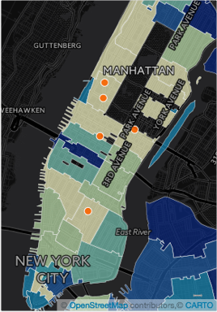
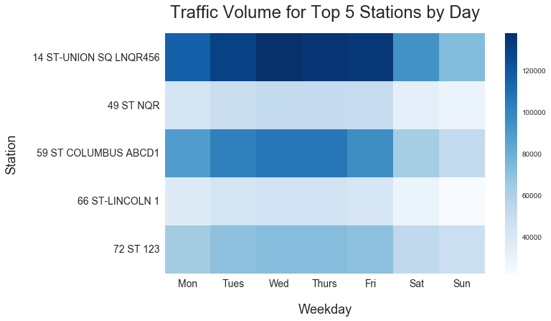
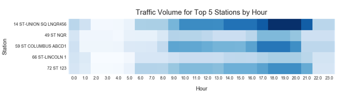

## Project Description      
WomenTechWomenYes (WTWY) has an annual gala at the beginning of the summer. The management has decided to place street teams at entrances to subway stations to collect email addresses and those who sign up are sent free tickets to the gala.  
Our task is use [MTA turnstile data](http://web.mta.info/developers/turnstile.html) to optimize the placement of street teams so that they can collect the most signatures from people who will attend the gala and contribute to its cause.  

## Our Approach        
The natural approach would be locating the stations with the highest volumes and placing the street teams during their busiest hours. However, is this approach sufficient? Can we make the assumption that every signature collected has an equal chance to be a potential donor?  
[Open Secrets](https://www.opensecrets.org/outsidespending/donor_stats.php?cycle=2016&type=I) suggests that the top 1% of individual donors made 43% of all donations in the 2016 election cycle so far. This made us think that it's not the quantity of signatures that matters but the quality. We should focus our attention on maximizing the opportunity to find the people that could potentially make substantial donations.  
So here is an outline of our approach:  
1.Rank the zip codes using the demographic data and political donation data. Demographic data from [ZIP atlas](http://zipatlas.com/us/ny/new-york.htm) consists of female population, percentage that takes public transportation to work, and percentage in the 200k+ households. We use the product of these factors as a proxy for the availability of donors (DA). In the absence of data of donation to causes of technology awareness, we use the political donation made by women working in technological sector as a proxy for the willingness of donors (DW). DA and DW is combined to produce the final rank.  
2.Rank the stations based on volumes. Thanks to Dave on our team, we were able to download all MTA turnstile data from 2010. We decided to focus on the three-month window March to May because of its slightly higher-than-average volumes and its proximity to the gala.  
3.Combine rank1 and rank2 to find the stations that are both rich in potential donors and high in volumes.  

## Solution  
  
The map displays the rank of zip codes in heatmap format, with lighter color being donor-rich areas. The top 10 zip codes are a mixture of high-income residential areas and tech hubs. We use [google reverse geocoding](https://developers.google.com/maps/documentation/geocoding/intro#ReverseGeocoding) to find the stations that are located in these zip codes. Then we check if they also appear in the top 50 volume-ranked list. These are the five stations that we choose to be our target stations:
- 14 ST-UNION SQ LNQR456    
- 59 ST-COLUMBUS ABCD1   
- 72 ST 123   
- 66 ST-LINCOLN 1   
- 49 ST-7 AVE NQR   
We then look at the volumes at the 5 target stations by weekday and by hour to determine the best time to deploy. The two heatmaps are created from turnstile data from March to May in 2015 and 2016.

  
It appears that the best day to deploy is Wednesday and best time is between 5-8 PM.  

## Scheduling  
Depending on the resources available to the staff team, the scheduling of the team can get complicated. If a larget number of staff is available, then we probably should set up a test run to find the approximate hit rate, and then we can decide on how to allocate the team based on the foot traffic and hit rate at each station.
